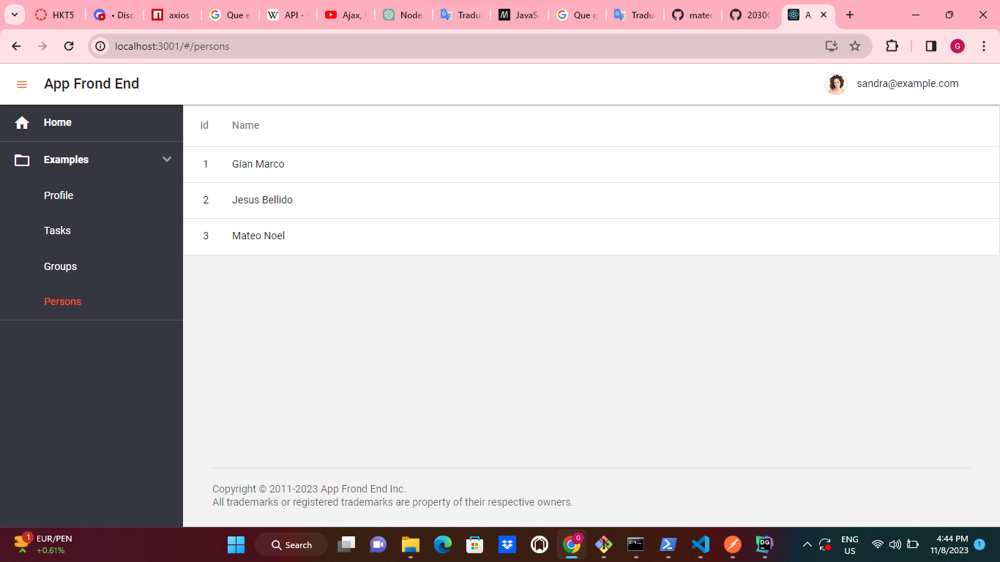
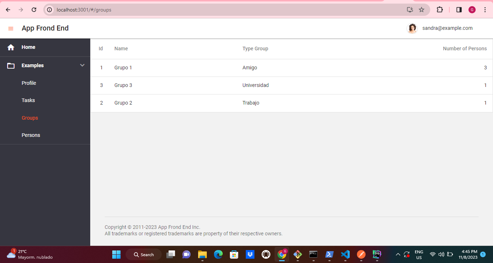
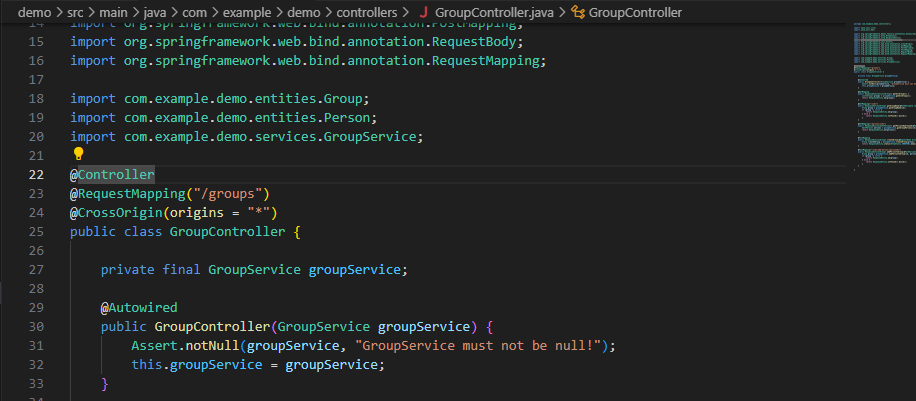
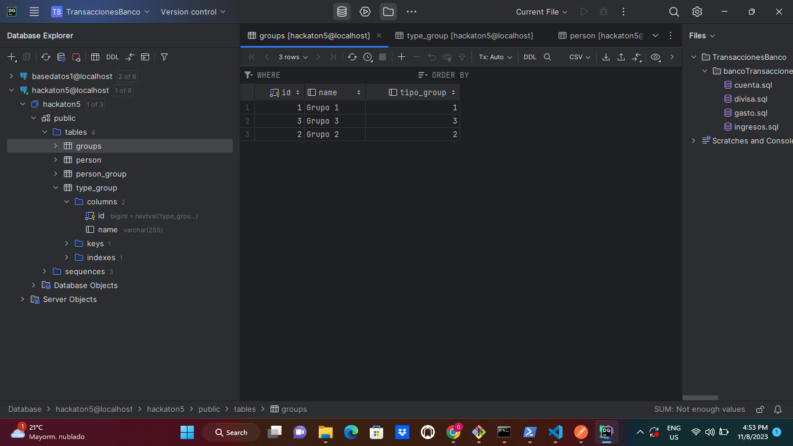
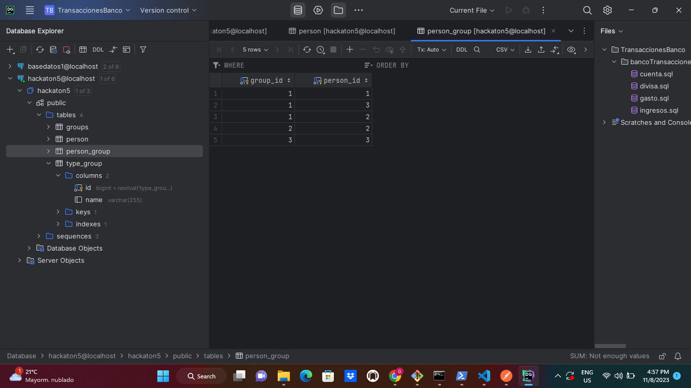

# Hackaton5GMAA
Desarrollo de una API para luego consumirlos con devextream-react

# Devextreme

## Persons



## Groups and GroupTypes




## Aprendizaje de este Hackaton
---
```@CrossOrigin(origins = "*")```
---
Cuando ponemos encima del controlador permite aceptar todos todas las peticiones que se le realice.



## Tabla en la base de datos de la entidad Group




## Tabla en la base de datos de la entidad Person


## Tabla en la base de datos de la entidad TypeGroup


## Tabla intermedia en la base de datos que relaciona Person con Group

